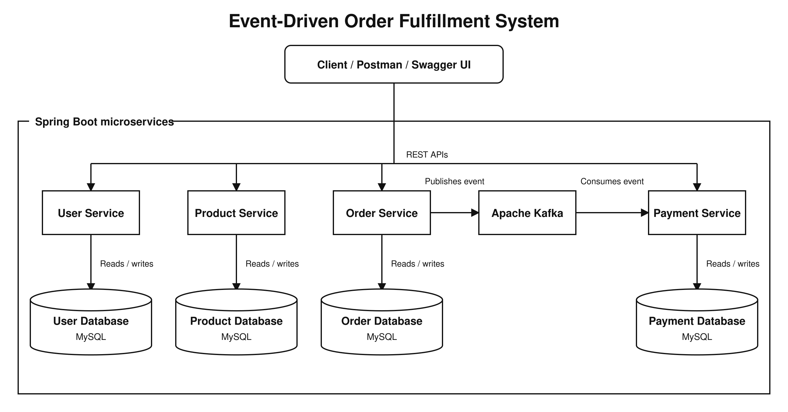

# Event-Driven Order Fulfillment System

This is a personal backend project developed to practise building microservices with Spring Boot and Apache Kafka. It models a basic order fulfilment process using separate services for orders, products, payments and users.

When a new order is created, the Order Service stores the order and publishes an event to Kafka. The Payment Service consumes the event and creates the corresponding payment record. Duplicate payment processing is prevented by checking the order number before saving a new payment.

## Project Architecture

The system consists of four Spring Boot microservices: User Service, Product Service, Order Service, and Payment Service. Each service uses its own MySQL database. The Order Service publishes an `OrderCreatedEvent` to Apache Kafka, which is consumed by the Payment Service.



## Services

- **Order Service** – Creates and retrieves customer orders.
- **Product Service** – Manages product information and stock data.
- **Payment Service** – Processes order events received through Kafka and provides payment details.
- **User Service** – Manages user information.

## Technologies

- Java 17
- Spring Boot
- Spring Data JPA
- REST APIs
- Apache Kafka
- MySQL
- Maven
- JUnit 5 and Mockito
- Swagger/OpenAPI
- Postman
- GitHub Actions

## Application Flow

1. The client sends a request to create an order.
2. The Order Service saves the order in its database.
3. An `OrderCreatedEvent` is published to Kafka.
4. The Payment Service consumes the event.
5. The Payment Service checks whether a payment already exists for the order.
6. If no payment exists, a new payment record is created.

## Service Ports

| Service | Port |
|---|---:|
| Order Service | 8081 |
| Product Service | 8082 |
| Payment Service | 8083 |
| User Service | 8084 |

## Main API Endpoints

### Order Service

```text
POST /api/orders
GET  /api/orders
GET  /api/orders/{orderNumber}
```

### Payment Service

```text
GET /api/payments
GET /api/payments/order/{orderNumber}
```

The remaining endpoints can be viewed and tested through Swagger UI.

## Running the Project

### Requirements

Before starting the services, make sure the following are installed and running:

- Java 17
- Maven
- MySQL
- Apache Kafka

Update the database username and password in the `application.properties` file of each service.

Start every service separately:

```bash
cd order-service
mvn spring-boot:run
```

Repeat the command for `product-service`, `payment-service` and `user-service`.

## API Documentation

Swagger UI is available at:

```text
http://localhost:8081/swagger-ui/index.html
http://localhost:8082/swagger-ui/index.html
http://localhost:8083/swagger-ui/index.html
http://localhost:8084/swagger-ui/index.html
```

The APIs can also be tested using Postman.

## Testing

The services contain unit tests written with JUnit 5 and Mockito.

Run the tests inside an individual service:

```bash
mvn clean test
```

A GitHub Actions workflow is also configured to run the Maven tests automatically when code changes are pushed to the repository.

## Project Status

The main microservices, REST APIs, database operations, Kafka communication and service tests are implemented.

Planned improvements include:

- Spring Security and JWT authentication
- Centralised exception handling
- Docker and Docker Compose
